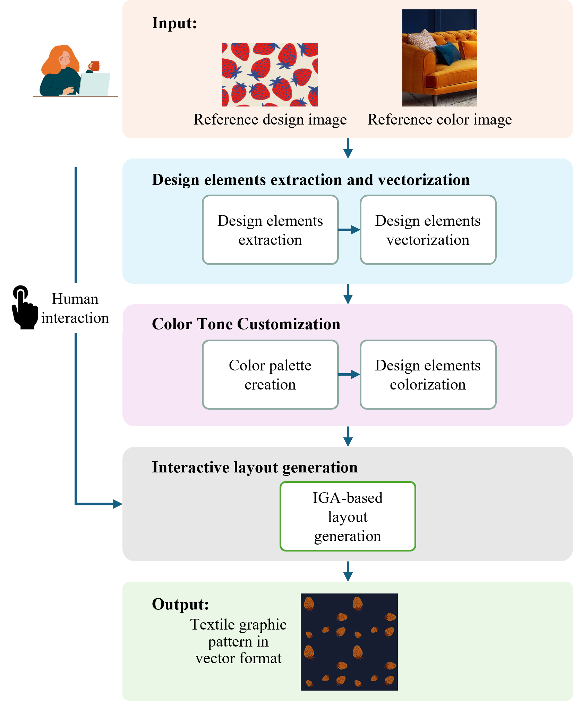
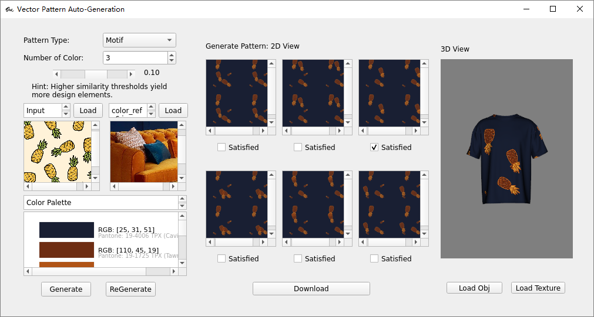
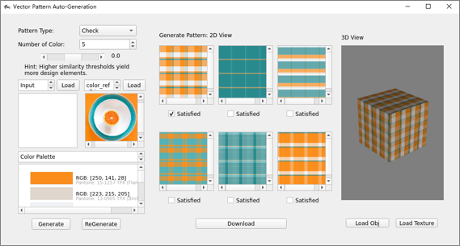
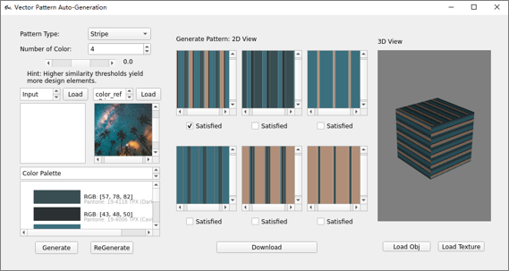

# Interactive Design System for Textile Graphic Pattern Generation in Vector format
This repository contains code and materials for the paper _Interactive Design System for Textile Graphic Pattern Generation in Vector format_, contributed by Hong QU, Honghong He, K. P. Chau, and P. Y. Mok*. All rights reserved by authors.

-----
## Introduction
This study proposes an intelligent system for interactive vector pattern generation to address the labor-intensive process of creating scalable and production-ready patterns in the fashion and textile industries. The system integrates an Interactive Genetic Algorithm (IGA) for layout generation and a colorization mechanism guided by reference images, enabling users to produce editable and aesthetically pleasing patterns efficiently. It also recommends Pantone TPX codes to streamline production workflows. Experimental results demonstrate the system’s ability to generate high-quality vector patterns in under a second, meeting industry standards for usability, efficiency, and human aesthetics. A survey with fashion professionals confirmed its practicality and potential for design support. While the system depends on high-quality reference images, future improvements will focus on enhancing pattern diversity and accessibility for non-expert users. This study offers a practical tool for automated vector pattern design, contributing to the advancement of computer-aided design in the fashion industry.




## Installation and Usage
- Our project is developed under **Ubuntu 20.04**.
- Install [Potrace](https://potrace.sourceforge.net/). Follow its official manual.
- Please see the _requirements.txt_
```
git clone https://github.com/ZoeQU/DesignGenerationVector-GUI.git

cd DesignGenerationVector-GUI/

conda create --name my_env python=3.8 -y
conda activate my_env
conda install pip -y

pip install -r requirements.txt

python main.py
```

## User Instructions & Application demo
We provide an interactive tool that allows users to efficiently generate vector graphic patterns with just a few clicks. [Download demo video.](assets/demo_motif.mp4)



In addition, the proposed system incorporates additional algorithms for generating [check](assets/demo_check.mp4) and [stripe](assets/demo_stripe.mp4) patterns, which are fundamental and widely used in textile and fabric design. 

<p align="center">
  
  
</p>


